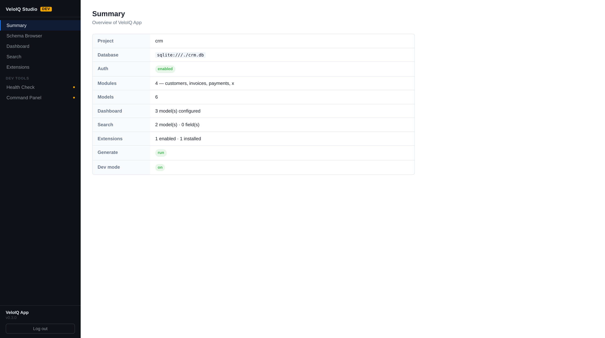
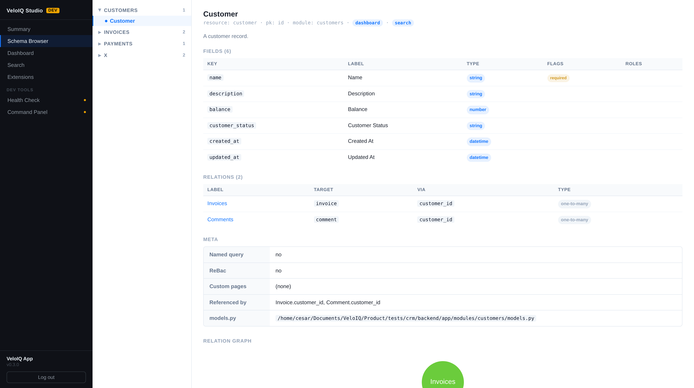
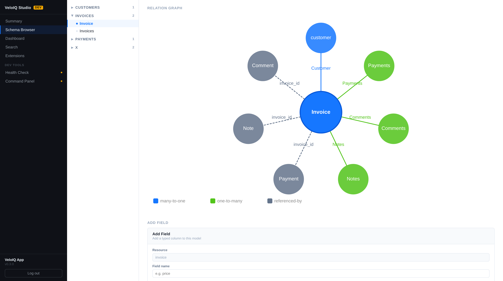
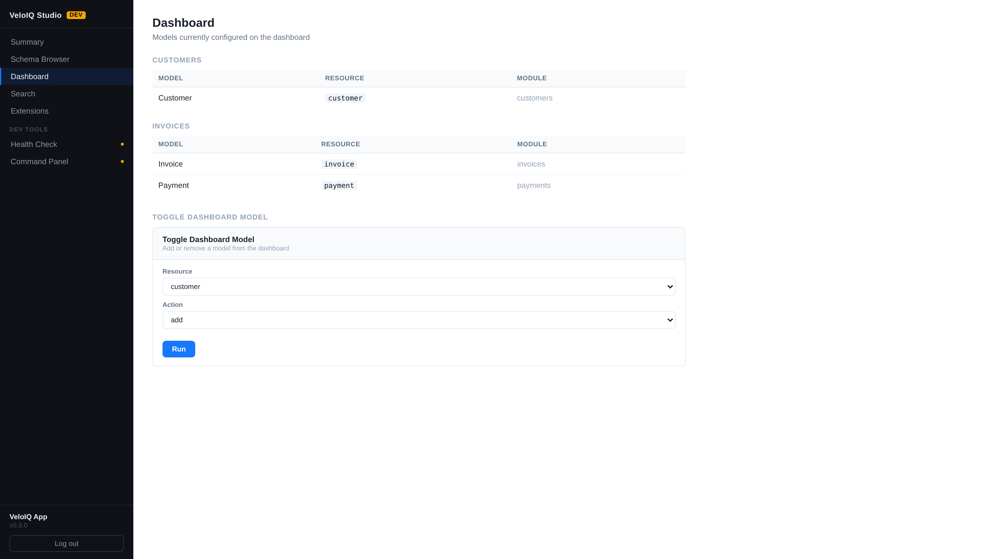
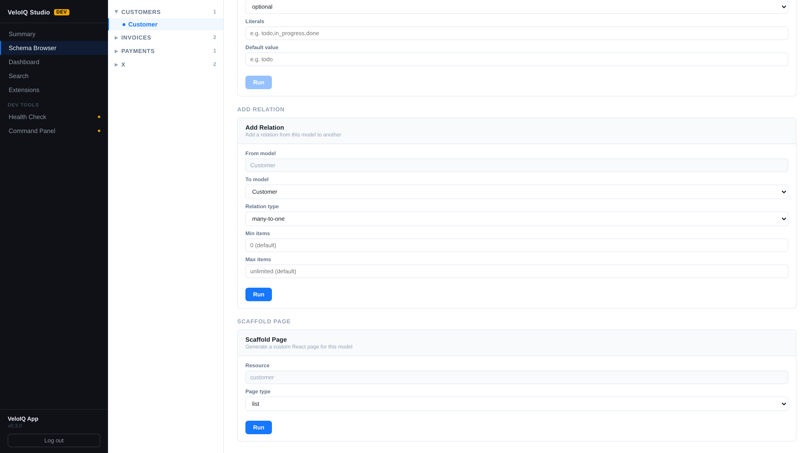

# CLI Tools & Interactive Explorer

VeloIQ ships a rich CLI (`veloiq`), an interactive terminal explorer (TUI), and a browser-based developer dashboard (VeloIQ Studio) to help developers understand, navigate, and evolve their project.

---

## VeloIQ Studio

VeloIQ Studio is a browser-based developer dashboard mounted automatically by `create_veloiq_app()` — no host-app code changes required. It is always available while the server is running.

```
http://localhost:8000/veloiq-studio/
```

### Access control

| Capability | Requirement |
|---|---|
| View schema, dashboard, search, extensions | `Admin` role (JWT) |
| Run scaffolding commands | `Admin` role **and** `VELOIQ_DEV=true` env var |

Log in with the same credentials as the main application. The studio reads the `jm_access_token` from localStorage, so you stay logged in across page refreshes.

### Pages

**Summary** — project name, database URL, module/model counts, dashboard and search enrollment, extensions, and dev mode status — the first page shown on login.



**Schema Browser** — module/model tree on the left, detail panel on the right.  
- Module view: lists all models with field count, dashboard and search status. Add Model command pre-fills the module.  
- Model view: Fields section (plain columns), Relations section (many-to-one FK parents + one-to-many / many-to-many ORM relations), Meta section, and a **Relation Graph** showing all connections as a colour-coded orbit diagram. In dev mode, Add Field, Add Relation, and Scaffold Page commands appear pre-filled with the selected model.



The **Relation Graph** at the bottom of each model detail shows every forward and reverse connection. Nodes are colour-coded by type (blue = many-to-one, green = one-to-many, purple = many-to-many, grey = referenced-by). Click any satellite node to navigate to that model within the studio.



The **Named Query Creator** sits below the Relation Graph on each model detail page (dev mode only). It lets you define a cross-model read query — entirely in the browser, with no Python coding required. Named queries are stored as `named_queries.json` in the module directory and are surfaced as first-class resources in the frontend (with their own list, show, and filter views).

#### Creating a named query

1. Open a model in the Schema Browser.
2. Scroll to **Named Queries** and click **+ New Named Query**.
3. Fill in the form:

| Section | What you configure |
|---|---|
| **Basic Info** | Slug name (used as the route key), human-readable label, list view type (`table`, `gallery`, `calendar`) |
| **Joins** | Tick related models to JOIN; set an alias for each join to prefix field names |
| **Fields** | Toggle which columns appear in the result; the primary key is always included (shown with a `[pk]` badge). Named query rows must be identifiable for show/edit navigation |
| **Field Labels** | Override the display label for any selected field; field type is read-only (inferred from schema) |
| **Default Filters** | SQL WHERE clauses baked into every request — supports `eq`, `ne`, `contains`, `gt`, `gte`, `lt`, `lte` |
| **Default Sort** | Ordered list of `{field, asc/desc}` entries applied as `ORDER BY` |

4. Click **Create** (or **Update** for an existing query). The studio automatically runs `veloiq generate` and streams the output; the new resource appears in the frontend navigation as soon as generation completes.

#### How named queries work

- Stored in `backend/app/modules/<module>/named_queries.json` — committed alongside your models.
- Loaded at app startup by the framework module loader; each query registers its own read-only REST router.
- Joined via ORM relationships (not raw SQL `JOIN`) — the framework resolves the SQLAlchemy relationship attribute automatically.
- Multi-sort order is fully respected at the database level (`ORDER BY col1 ASC, col2 DESC ...`).
- The primary key of the root model is always SELECTed (even if the user did not tick it), ensuring every row has a valid `eid` for frontend navigation.
- Cross-model filter fields reference the output column alias, so filters work regardless of which table a column comes from.

Named queries appear in the module view under **Named Queries** with a count badge, and in the frontend as a dedicated list page that supports advanced filtering, sorting, and show/detail navigation into the root model's show page.

**Dashboard** — models currently configured on the dashboard, grouped by tab. Toggle Dashboard Model command (dev mode).



**Search** — indexed models and fields. Toggle Search Model and Toggle Search Field commands (dev mode).

**Extensions** — installed extensions and their enabled/disabled status. Enable/Disable toggle (dev mode).

**Command Panel** — global Add Module, Add Model, and Generate commands. In dev mode, Add Field, Add Relation, and Scaffold Page appear pre-filled with the selected model context.



**Health** — output of `veloiq check` (dev mode only).

### Dev mode commands

All write commands (`add-model`, `add-field`, `add-relation`, `scaffold-page`, etc.) require `VELOIQ_DEV=true`. Set it in your `backend/.env`:

```
VELOIQ_DEV=true
```

After any successful command, the studio automatically runs `veloiq generate` and refreshes the schema without a page reload. If the uvicorn `--reload` worker restarts mid-command (because a file changed), the studio detects the dropped connection, waits for the server to come back online, then completes the generate and refresh cycle.

Database migrations are **not** run automatically from the studio. After adding fields or relations, run migrations manually:

```bash
veloiq db migrate -m "describe change"
veloiq db upgrade
```

### Add Field options

| Input | CLI flag | Notes |
|---|---|---|
| Field name | positional | snake_case |
| Field type | positional | str, text, int, float, bool, date, datetime, … |
| Nullable | `--optional` / `--required` | default: optional |
| Literals | `--options` | comma-separated, e.g. `todo,in_progress,done` |
| Default value | `--default` | e.g. `todo` |

### Add Relation options

| Input | CLI flag | Notes |
|---|---|---|
| Relation type | `--type` | `many-to-one` (FK) or `many-to-many` (link table) |
| Min items | `--min-items` | cardinality lower bound on the list side |
| Max items | `--max-items` | cardinality upper bound on the list side |

### Set Title Fields options

| Input | CLI flag | Notes |
|---|---|---|
| Title fields | `--fields` | Ordered rows, each a dropdown of the model's fields **plus** the special `Model name` / `Primary key` tokens (rendered in brackets). A live preview shows the resulting title |
| Clear | `--clear` | Remove all rows to restore the automatic title |

---

## Interactive Explorer (TUI)

Run `veloiq` with no arguments from any directory inside a VeloIQ project:

```bash
veloiq
```

The TUI loads your project's modules, models, fields, relations, dashboard configuration, search enrollment, extension state, and custom-page scaffolds from the generated schema files.

### Navigation

| Key | Action |
|-----|--------|
| `↑ ↓` / `j k` | Move cursor |
| `Enter` | Drill into selected item |
| `b` / `Backspace` / `Esc` | Go back |
| `q` | Quit |
| `g` | Run `veloiq generate` (with confirmation) |
| `c` | Run `veloiq check` — health report (from home screen) |
| `m` | Add a model — prompts for name, runs `veloiq add-model` (modules list and module detail) |

### Model list — type-to-filter

Inside a module's model list, press `/` to open a filter prompt. Type any substring of a model name or resource key and press Enter — the list narrows instantly. Press `x` to clear the filter.

```
  Filter: "task"  (2/5 models)  [/] change  [x] clear
```

### Model detail screen

Selecting a model opens a scrollable detail screen showing:

- **Path** to `models.py` in the repository
- **Model description** from the class docstring
- **Fields** — type, required/read-only flag, default value, valid options, per-field description, and RBAC roles
- **Relations** — inferred type (`one-to-many`, `self-ref`, `many-to-many`), target resource, and via-key
- **Referenced by** — which other models have a FK pointing to this model
- **Configuration** — dashboard tab, search enrollment, permissions, ReBAC, custom-page scaffolds
- **Endpoints** — the five REST routes generated for the resource with access summary

#### Jump to a related model — `[f] follow`

Press `f` in the model detail screen to jump directly to a related model's detail page without navigating back through the module list. A numbered prompt lists all navigable targets (relations + FK references):

```
  Jump to: [1] Tasks  [2] Owner  [Esc] cancel
```

Press the corresponding number key to navigate. Press `Esc` to cancel.

#### Actions from model detail

| Key | Action |
|-----|--------|
| `f` | Follow → jump to a related model |
| `a` | Add a field — prompts for name and type, runs `veloiq add-field` |
| `r` | Add a relation — prompts for type, target, and attr names, runs `veloiq add-relation` |
| `d` / `D` | Add / remove from dashboard |
| `s` / `S` | Enroll / remove from search |
| `p` | Scaffold a custom page for this model |
| `t` | Set the model's **title fields** — opens a picker of the model's fields plus the special `Model name` / `Primary key` tokens, then runs `veloiq set-title` |
| `g` | Run `veloiq generate` |
| `b` | Back to module |

---

## `veloiq check`

Run a health check on the current project and surface common configuration gaps:

```bash
veloiq check
veloiq check --strict        # exit 1 if any warnings found
veloiq check --root ./my-app # specify project root explicitly
```

Reports:

| Issue | Severity |
|-------|----------|
| Model has no class docstring | Warning |
| Required field has no `description=` | Warning |
| Enum field has options but no default value | Warning |
| Model not on dashboard | Warning |
| Model not enrolled in search | Warning |

**Example output:**

```
Found 0 error(s) and 3 warning(s) in my-app

WARNINGS
  ⚠️   team/TeamMember                         No model description — add a class docstring
  ⚠️   team/TeamMember.name                    Required field has no description
  ⚠️   team/TeamMember.email                   Required field has no description
```

Run `veloiq check` as part of CI to enforce description coverage or dashboard enrollment before a release.

---

## `veloiq add-model`

Add a new model class to a VeloIQ project without editing `models.py` manually:

```bash
veloiq add-model <ModelName> [options]
```

| Argument / Option | Description |
|-------------------|-------------|
| `MODEL_NAME` | PascalCase class name (e.g. `Invoice`, `TeamMember`) |
| `--module NAME` | Module to place the model in (default: pluralized snake_case of model name). Created automatically if it does not exist. |
| `--description TEXT` | One-line docstring for the model class |
| `--migrate / --no-migrate` | Run Alembic migration after adding. Default: prompt |
| `--root / -C` | Project root override |

**Examples:**

```bash
# Create Invoice — auto-creates an 'invoices' module
veloiq add-model Invoice

# Create Invoice in an existing 'billing' module with a description
veloiq add-model Invoice --module billing --description "A customer invoice"

# Create TeamMember in a module named 'team' (not 'team_members')
veloiq add-model TeamMember --module team
```

Every new model starts with two fields — `name: str` and `description: Optional[str]` — following VeloIQ's standard scaffold. Add more fields with `veloiq add-field` and relations with `veloiq add-relation`.

**Existing module:** the class is appended to the existing `models.py`; `navigation.config.json` is updated and `veloiq generate` runs automatically.

**New module:** a full module scaffold is written: `__init__.py`, `models.py`, `custom_api.py`, and a navigation entry.

> **TUI:** Press `m` from the modules list or from a module's model list to add a model interactively — it prompts for the name and runs the command with confirmation.

---

## `veloiq add-field`

Add a field to an existing model without editing `models.py` manually:

```bash
veloiq add-field <model> <field_name> [field_type] [options]
```

| Argument / Option | Description |
|-------------------|-------------|
| `MODEL` | Model class name (`Task`) or resource/table name (`task`) |
| `FIELD_NAME` | Snake-case attribute name for the new field |
| `FIELD_TYPE` | `str` (default), `text`, `int`, `float`, `bool`, `date`, `datetime` |
| `--optional / --required` | Make the field `Optional` (nullable). Default: `--optional` |
| `--default VALUE` | Default value (e.g. `active`, `0`, `true`) |
| `--description TEXT` | Field description shown in TUI and emitted to gen.ts |
| `--options a,b,c` | Comma-separated valid values — uses `veloiq_field()` automatically |
| `--migrate` | Automatically run `alembic autogenerate` + `upgrade head` (no prompt) |
| `--no-migrate` | Skip migration entirely (useful in CI or when batching changes) |

**Examples:**

```bash
# Simple optional string field (will prompt to run migration)
veloiq add-field Task notes str --description "Internal notes"

# Required float with description
veloiq add-field project budget float --required --description "Budget cap in USD"

# Enum field — automatically uses veloiq_field() and emits options to gen.ts
veloiq add-field task priority str \
  --options low,medium,high,critical \
  --default medium \
  --description "Task urgency level"

# Date field — skip migration prompt (run manually later)
veloiq add-field task resolved_at date --description "When the task was closed" --no-migrate

# Auto-apply migration without prompting (CI / scripted workflows)
veloiq add-field task resolved_at date --migrate
```

After writing the field, `veloiq add-field` checks whether Alembic is configured in the project's `backend/` directory. If `alembic.ini` is found, it prompts:

```
   Run database migration now? (alembic autogenerate + upgrade head) [Y/n]:
```

Answering **Y** runs:
1. `alembic revision --autogenerate -m "add <field_name> to <model>"`
2. `alembic upgrade head`

This ensures the database column is created immediately, avoiding the `OperationalError: no such column` error when the backend restarts.

> **Note:** New models created with `veloiq add-module` do not require explicit migrations — VeloIQ calls `SQLModel.metadata.create_all()` on startup, which creates missing tables automatically. Migrations are only needed when adding columns to **existing** tables.

**Type reference:**

| CLI type | Python annotation | Notes |
|----------|------------------|-------|
| `str` | `str` | Standard VARCHAR column |
| `text` | `str` | Uses `Column(Text)` for long content |
| `int` | `int` | Integer column |
| `float` | `float` | Floating-point column |
| `bool` | `bool` | Boolean column |
| `date` | `datetime.date` | Date-only column |
| `datetime` | `datetime.datetime` | Full timestamp column |

---

## `veloiq add-relation`

Add a relation between two models without editing `models.py` manually:

```bash
veloiq add-relation <source> <target> [options]
```

| Argument / Option | Description |
|-------------------|-------------|
| `SOURCE` | Model that holds the FK or initiates the relation (e.g., `Task`) |
| `TARGET` | Model being referenced (e.g., `Project`) |
| `--type fk\|many-to-many` | Relation type (default: `fk`) |
| `--attr NAME` | Attribute name on source (default: snake_case of TARGET) |
| `--back-attr NAME` | Attribute name on target for `back_populates` (default: snake_case of SOURCE + `s`) |
| `--min-items INT` | Minimum cardinality on the List side (default: `0`) |
| `--max-items INT` | Maximum cardinality on the List side (default: unlimited) |
| `--required / --optional` | Make FK non-nullable (`fk` type only). Default: optional |
| `--no-back` | Skip adding the reverse relationship to the target model |
| `--migrate / --no-migrate` | Run Alembic migration after adding. Default: prompt |

**Examples:**

```bash
# Task belongs to Project (adds FK column + relationship on Task, reverse on Project)
veloiq add-relation Task Project

# Explicit names + required FK
veloiq add-relation Task Project --attr project --back-attr tasks --required

# Enforce that a project must have at least one task
veloiq add-relation Task Project --min-items 1

# Many-to-many: Task ↔ Tag (creates TaskTagLink table, List relations on both sides)
veloiq add-relation Task Tag --type many-to-many

# Many-to-many with custom attr names
veloiq add-relation Task Tag --type many-to-many --attr tags --back-attr tasks
```

**What gets written — FK (many-to-one):**

In `source/models.py`:
```python
# FK column (before existing relationships)
project_id: Optional[int] = Field(default=None, foreign_key="project.id")

# Relationship (after existing relationships)
project: Optional["Project"] = jm_relationship(back_populates="tasks")
```

In `target/models.py`:
```python
tasks: List["Task"] = jm_relationship(back_populates="project")
```

Both files get the correct `TYPE_CHECKING` import guard automatically.

**What gets written — many-to-many:**

In `source/models.py` (link class added above the main class):
```python
class TaskTagLink(SQLModel, table=True):
    __tablename__ = "task_tag_link"
    task_id: Optional[int] = Field(default=None, foreign_key="task.id", primary_key=True)
    tag_id: Optional[int] = Field(default=None, foreign_key="tag.id", primary_key=True)

# Inside Task:
tags: List["Tag"] = jm_relationship(back_populates="tasks", link_model=TaskTagLink)
```

In `target/models.py` (`TaskTagLink` imported directly — not inside `TYPE_CHECKING`, since it's needed at runtime):
```python
from app.modules.tasks.models import TaskTagLink

# Inside Tag:
tasks: List["Task"] = jm_relationship(back_populates="tags", link_model=TaskTagLink)
```

After running, the relation is wired in both directions. Run `veloiq generate` to update the TypeScript schemas, then `veloiq db upgrade` to apply the migration (or answer **Y** at the prompt).

---

## `veloiq scaffold-page`

See [Custom Page Scaffolding](scaffold-page.md) for full documentation.

---

## `veloiq set-title`

Define or change which fields compose a model's **title** — the human-readable label shown across the UI (list rows, relation pickers, reference links, show-page headings). By default the title is derived automatically from the model's first text field; this command lets you pin the exact fields, in order.

The configuration is stored on the model class as `__veloiq_ui__["titleFields"]`. It is **entirely optional** and **backwards compatible** (a model with no title fields keeps the automatic behaviour), and the command works on **any existing model**, not just freshly scaffolded ones.

```bash
veloiq set-title <model> --fields a,b,c
```

| Argument / Option | Description |
|-------------------|-------------|
| `MODEL` | Model class name (`Contact`) or resource/table name (`contact`) |
| `--fields a,b,c` | Comma-separated field names whose values compose the title, in order |
| `--clear` | Remove the configured title fields and restore automatic derivation |
| `--no-generate` | Skip the automatic `veloiq generate` after editing |
| `--root / -C` | Project root override |

The title is the chosen field values joined by a single space. Two **special tokens** are also accepted in `--fields` and are rendered in **[brackets]** at runtime:

| Token (or alias) | Renders as |
|---|---|
| `__model_name__` (alias `model_name`) | the model's name, e.g. `[Contact]` |
| `__pk__` (alias `pk`) | the record's primary-key value, e.g. `[42]` |

**Examples:**

```bash
# Title = "first_name last_name"
veloiq set-title Contact --fields first_name,last_name

# Title = "[Film] The Matrix"  — model name in brackets, then a real field
veloiq set-title Film --fields model_name,title

# Title = "[42] The Matrix"  — primary key in brackets
veloiq set-title Film --fields pk,title

# Restore the automatic single-field title
veloiq set-title Contact --clear
```

After writing the model, `veloiq set-title` regenerates the frontend schemas so the new title reaches the UI (pass `--no-generate` to skip). The same configuration is also available from the **Set Title Fields** card in VeloIQ Studio and the `t` action in the interactive Explorer — both surface the currently configured fields and offer the special tokens as selectable options. See also [Model title (record label)](module-authoring.md#model-title-record-label).

---

## `veloiq build`

Build the host app's frontend for production deployment — no Vite dev server
needed at runtime.

```bash
veloiq build
veloiq build --frontend-dir /path/to/frontend
```

Runs `npm run build` in the frontend directory, producing `frontend/dist/`.
Once built, `veloiq run` serves the compiled React app directly at `/`
alongside the API — the whole application runs on a single port.

The scaffolded `main.py` already wires this up: when `frontend/dist/` exists,
`serve_frontend` is set automatically; when it does not, the app falls back to
development mode.

```python
_frontend_dist = Path(__file__).parent.parent.parent / \"frontend\" / \"dist\"

app = create_veloiq_app(VeloIQConfig(
    serve_frontend=_frontend_dist if _frontend_dist.exists() else None,
))
```

Rebuild after any frontend change (`veloiq generate`, custom pages, etc.) and
restart the backend.

---

## Field metadata conventions

VeloIQ reads metadata from model field declarations and emits it into the TypeScript schema (`gen.ts`) so the frontend can use it:

```python
from sqlmodel import Field
from veloiq_framework import veloiq_field

class Task(TimestampedModel, table=True):
    """A unit of work that belongs to a project."""   # → ModelDef.description

    title: str = Field(description="Short summary")   # → FieldDef.description

    status: str = veloiq_field(
        default="todo",
        options=["todo", "in_progress", "done"],      # → FieldDef.options (Select dropdown)
        description="Current workflow state",
    )
```

- **Class docstring** → `ModelDef.description` — shown in the TUI model detail and available to the frontend
- **`Field(description=...)`** → `FieldDef.description` — shown in the TUI as `└ ...` under each field
- **`veloiq_field(options=[...])`** → `FieldDef.options` — renders as a `<Select>` dropdown in Create/Edit forms
- **`veloiq_field(default=...)`** / **`Field(default=...)`** → `FieldDef.default` — pre-fills the Create form

Run `veloiq generate` after any model change to sync these values into the frontend schema files.
